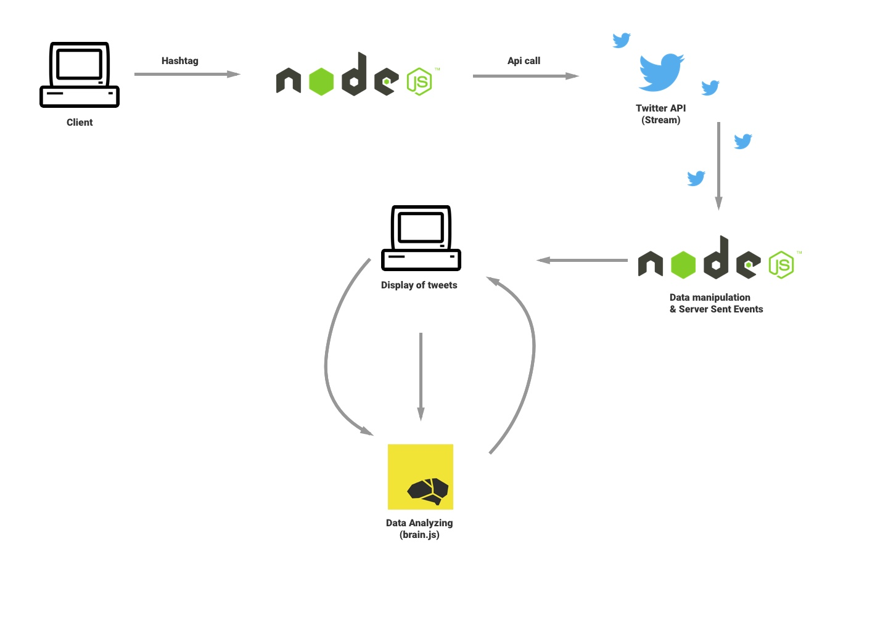

# Real Time Web Project

## Buzzword alert, using ML


## Table of Contents

*   [Introduction](#introduction)
*   [Getting Started](#getting-started)
*   [Flowchart](#flowchart)
*   [Checklist](#checklist)
*   [Kudos](#kudos)
*   [Licensing](#licensing)

---

## Introduction

This project is a tool that can stream tweets filtered on a hashtag in real-time, while analyzing the tweets and comparing new tweets to the old tweets.

In short, it looks at new tweets and can analyse if the tweets are spam or not.

## Flowchart




---

## Getting started

To install this project, please do the usual git cloning and then;

```sh
yarn install
```

To run the app:

```sh
yarn run start
```

To start developing the app:

```sh
yarn run dev
```

The data comes straight from the Twitter api. The tweets are being sent to the client using Server Sent Events.

This project does not use a database, the server is only used to manipulate and send data to the clients. In a future installment the analysing done by the clients can be sent back to the server as a JSON, so that the data can be trained heavily.

## Checklist

*   [x] Have this actually work
*   [x] Add gifs to the readme
*   [ ] Add styling (I'm sorry)
*   [ ] Move intense functions to separate threads using web workers (need help on this one)
*   [ ] Have a decent way to stop Twitter streams
*   [ ] Decent way to stop SSE streams
*   [x] Add another marked checkbox to feel better about myself
*   [ ] Save brain.js state

## Kudos

Special thanks to the people that helped me out:

[Brain.js issue](https://github.com/BrainJS/brain.js/issues/188)
[Servin](https://www.github.com/servinlp)

## Licensing

This project uses the MIT license.
